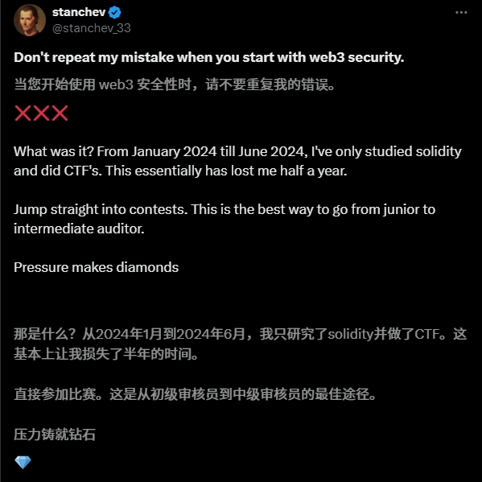
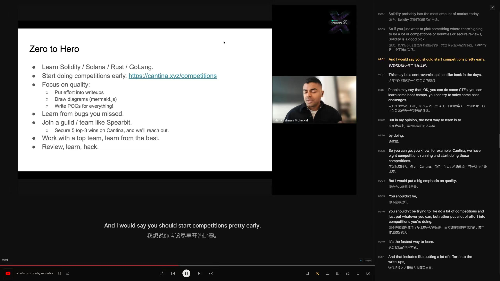

# Web3SecurityJourney

[English Version](README_EN.md)

欢迎来到 Web3SecurityJourney 项目！这个仓库专注于记录和分享我在 Web3 安全领域的学习路线和心得体会。在这里，您将找到资源、笔记以及我在 Web3 安全复杂性中探索的个人反思。

## 目录
- [介绍](#介绍)
- [声明](#声明)
- [我的心路历程](#我的心路历程)
- [我的学习路线](#我的学习路线)
- [资源](#资源)
- [联系](#联系)

## 介绍
Web3 安全是去中心化网络的关键方面。这个项目旨在提供一个我个人入行的心路历程以及过程中学习的资料和每个阶段的心得体会，以帮助更多新人了解和深入 Web3 安全。

## 声明
我自认为我本人的语言水平匮乏，可能写不出多么优美的文字表达，只能以我最直观的感受来表达我的状态，如果你愿意读下去，那么非常感谢。

## 我的心路历程

### 2022年
我的一个朋友告诉我说你也许应该看看 Web3，或许其中有能让我感到为之兴奋的东西。我听从了他的建议，查阅了一些关于 Web3 的说明，知道了它大概是什么东西，但是并不清楚我在其中能够做什么，成为什么，遂放弃。

### 2023年中旬
我正在准备一个比较重要的比赛，这期间我舅舅建议我可以尝试学习智能合约开发，并给我看了一些合约开发的资料，告诉我这个方向不错，或许我可以试试。我那时其实有一些关注我舅舅的建议（因为他是我们家族最厉害的人），但是并不完全相信他的建议（因为他并不是 IT 行业内的人，那时我自信的认为我自己的眼光也许要比我舅舅看的更透彻）。

所以我采取了将信将疑的态度关注了一段时间合约开发，搜集了一些教程，并学习了一下，发现这是一个很抽象的东西。我当时并不清楚所谓 `智能合约` 到底是什么东西，它到底能够做什么，能否挣到钱。在学习一段时间后我关注了一下政策以及就业情况，发现岗位屈指可数（主要招聘平台上的岗位数加起来不超过两位数），国家政策也并不支持，我认为此行灰暗无光，武断的认为我舅舅也许只是不知道在哪里听到的小道消息，自以为这是一个很好的方向，就草率的向我推荐，因此我又一次放弃了这个方向。

> 后来发现，或许我舅舅的推荐是完全正确的，只是当时的我并不了解这方面，误以为他给我的是一个错误的方向。从这里我吸取了教训，不应该过多忽视他人的建议，或许他们的建议是非常的好。

### 2023年8月
我通过数字游牧人这个博主了解到了 `数字游民` 这个概念，大概了解到了数字游民是一批不受地理位置限制的自由职业者。但有利有弊，利是时间自由、地理位置自由。弊是工作不稳定，时常会面临短期内没有工作的情况。我对这种状态是非常感兴趣的，但是此时的我并不知道我应该怎么进入数字游民的行列，例如我应该学习哪些知识，做什么岗位，所以此时也只是观望，并没有深入进去的打算。

### 2024年10月
通过博主数字游民的分享，我知道了一个分享 [Web3 工作招聘平台的 GitHub 项目](https://github.com/Web3-Club/Web3-Recruitment-Platform)，这也是我从旁观者真正决定加入 Web3 行业的开始。在了解了一段时候后我开始下定决心 All In Web3（缘由过长，所以不在此处过多赘述，如果有人愿意听的话，后面我可能会写一下）。

### 学习初期
我通过数字游牧人的推荐，知道了有两个基本的课程，一个是北京大学肖臻老师《区块链技术与应用》公开课，另一个是斯坦福大学多名教授联合授课的公开课（因为我并没有看这个，所以我并不清楚具体是什么）。

此刻的我仍然犹如一只无头苍蝇，只是知道大概方向，也就是我想要进入 Web3 行业，但是并不清楚具体的学习路线和我应该学习什么。那么我就想，既然如此那我就先从基础原理课程看起吧，也就是前面的两个课程。

### 阶段改变
非常感谢自己以前养成的良好的认知，我清楚的知道，计算机这一行业，单纯的依靠闷头学习是成不了的，必须多与人交流，或许大佬的一句话就可以让你受益匪浅。这个阶段，我在看北京大学肖臻老师《区块链技术与应用》公开课的同时，在社交平台上开始搜索关于 Web3 的信息，偶然的机会，我在小红书上看到一个看着像 Web3 大佬的博主（事后证明我没看错，人家确实很厉害，`如果说我后面成功进入了 Web3 行业，那么对方可以说就是我路上遇到的贵人`），我看到人家建了一个 Web3 交流群，人不多，就十个人，我抱着进去看看的想法申请加入了。

### 一个好的引路人是重要的
我原以为，只要我学习了区块链基础课程，并学习了合约开发，通过招聘平台找一下比较基础的实习，不断积累经验，我就可以成功加入这个行业。

下面所指的`他`，就是我上文所说的那位大佬，与他交流以后，大佬人很好, 他告诉我很多重要的点：

1. 首先我说明了我正在看基础性的课程，在学习一些基础，他告诉我说，其实前期并不需要看那么多的原理性的知识，实际上还用不上，会增加理解难度，可能遇到问题了再回溯这些原理会更好。
2. 我一开始其实想着入行做合约开发,但是大佬告诉我,其实现状就是招聘的公司只希望找到有合约开发经验会gas优化的合约开发工程师而不是新人, 那么就造成了一个死循环: `我不入行怎么有经验,我没有经验怎么入行`, 大佬给我指明了一个我从未了解过的方向,也就是智能合约安全竞赛,即`CTF`,通过这个比赛去积累经验,然后入行web3,至此我踏入了web3安全的道路.

> 我觉得一个教程是不能根本性的在一瞬间彻底改变一个人的，但是一个激动人心的故事和一个关键性的认知是有可能在一瞬间改变人的一生。

### 尝试走出自己的路
大佬推荐我的线路是,先学习合约开发基础和框架基础知识之后,开始刷CTF练习题(这里可能类似于参加算法比赛前练习的那些算法题),直到把每个题刷到滚瓜烂熟,熟记于心,然后就可以开始参加正式的竞赛了。

但是我在推特上和油管上刷到了两个博主,他们推荐尽快开始比赛,在比赛中快速成长,而不是在练习题上浪费过多时间,我认为这是非常对的,我喜欢这种方式,所以我准备在学习完必要基础后尽快开始打比赛,而不是走大佬推荐我的刷完练习题后再开始,可能这也跟我从小就不爱走寻常路有关吧。
 

### 过于相信自己的聪明才智
我在开始接触web3的时候认为我只要清楚学习路线，沿着学习路线下去总会有收获，因此我常常执着于看文档学习，认为那样学习更快。但是实际我发现我在学习很多不懂的知识的时候，并没有建立起对这个知识的大体框架，以至于看文档学的一知半解，看完了我也不知道我自己是否真正学会了他，所以我建议在面对一个不了解的领域的时候先别尝试自我探索，而是可以跟着一些视频课程进行学习，先建立自己对这个知识的大致理解，这样再自己自由探索或许会更好，否则就跟无头苍蝇一般。

但是我认为一个良好的视频课程和一个一般的视频课程差别很大，可能很多人建议先开始，不论是一个良好的视频课程 or 一个一般的视频课程，只要开始了再换都可以，但是我觉得如果你需要开始你应该合理评估每个课程，多看几个，多做对比，并找到其中你认为最适合你的，以及讲师水平比较高的课程进行，这样或许可以让你少浪费很多时间。

我刷X的时候看到了很多大佬推荐[Cyfrin Updraft](https://updraft.cyfrin.io/)，我前两天在学习foundry框架的时候看过他们的课程，我认为他们讲的很好，所以我现在开始跟随他开始学习。

## 我的学习路线
- **[cryptozombies](https://cryptozombies.io/)**: 一个僵尸游戏,通过构建一个web3游戏来学习solidity的教程。
- **[foundry](https://book.getfoundry.sh/)**: 一个流行的合约开发框架。
- **[hardhat](https://hardhat.org/)**: 一个流行的合约开发框架。
- **[openzeppelin](https://www.openzeppelin.com/)**: 合约最大的依赖库。
- **[Cyfrin Updraft](https://updraft.cyfrin.io/)**：一个很好的合约基础课程。

## 资源
- **书籍**: 《一本书读懂Web3.0：区块链、NFT、元宇宙和DAO 》 这本书讲解了一些web3的发展史和基本概念,可以加深一些对于web3的了解.
- **我认为应该看的一些文章(相信我,你读了会很有收获)**:
  1. [您作为 Immunefi 漏洞赏金猎人的第一天](https://medium.com/immunefi/your-first-day-as-a-bug-bounty-hunter-on-immunefi-9b101768a40c)
  2. [破解区块链：以太坊](https://medium.com/immunefi/hacking-the-blockchain-an-ultimate-guide-4f34b33c6e8b)

## 联系
欢迎合作或提问。
